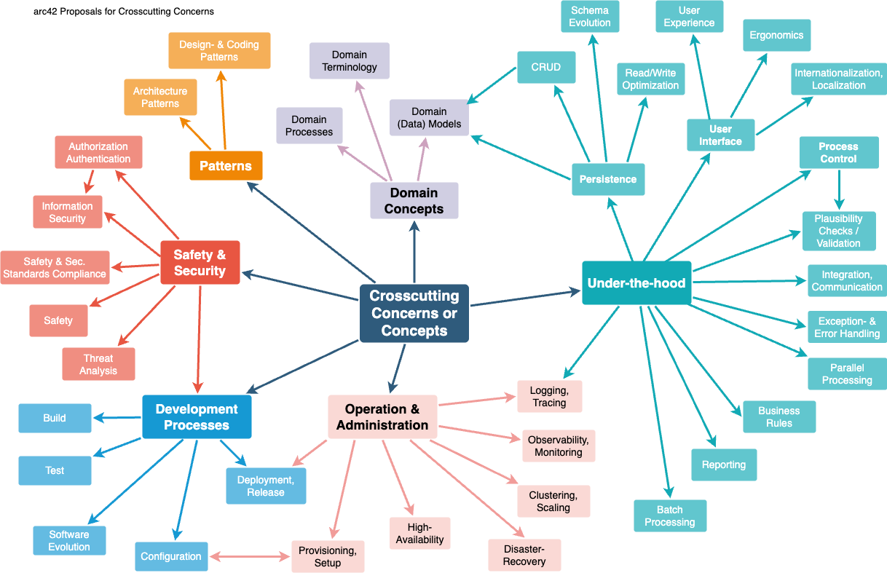

# Cross-cutting Concepts

**Content**

This section describes crosscutting concepts (practices, patterns,
regulations or solution ideas). Such concepts are often related to
multiple building blocks. They may include many different topics, such
as the topics shown in the following diagram:

<figure>

</figure>

**Motivation**

Concepts form the basis for *conceptual integrity* (consistency,
homogeneity) of the architecture. Thus, they are an important
contribution to achieve inner qualities of your system.

This is the place in the template that we provided for a cohesive
specification of such concepts.

Many of these concepts relate to or influence several of your building
blocks.

**Form**

The form can be varied:

- concept papers with any kind of structure

- example implementations,especially for technical concepts

- cross-cutting model excerpts or scenarios using notations of the
  architecture views

**Structure**

Pick **only** the most-needed topics for your system and assign each a
level-2 heading in this section (e.g. 8.1, 8.2 etc).

DO NOT ATTEMPT to cover all of the topics of the aforementioned diagram.

**Further Information**

Some topics within systems often concern multiple building blocks,
hardware elements or development processes. It might be easier to
communicate or document such *cross-cutting* topics at a central
location, instead of repeating them in the description of the concerned
building blocks, hardware elements or development processes.

Certain concepts might concern **all** elements of a system, others
might only be relevant for a few. In the diagram above, logging concerns
all three components, whereas security is relevant only for two
components.

See [Concepts](https://docs.arc42.org/section-8/) in the arc42
documentation.

## *\<Concept 1\>*

*\<explanation\>*

## *\<Concept 2\>*

*\<explanation\>*

…​

## *\<Concept n\>*

*\<explanation\>*
